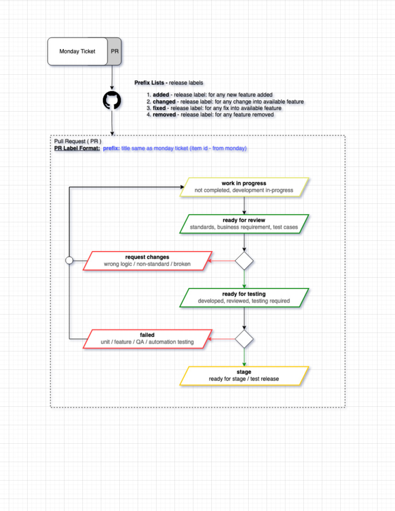

# HijazWorld
Hijaz is a spiritual sanctuary unmatched in the Western world. Hijaz offers the opportunity to all people to come and experience Muslim hospitality and learn about true Islam.

## Technologies
 - [node v16.19.1](https://nodejs.org/en/download/)
 - [npm 8.19.3](https://nodejs.org/en/download/)
 - [vue ^2.7.8](https://v2.vuejs.org/)
 - [@vue/cli 5.0.8](https://cli.vuejs.org/)
 - [docker](https://www.docker.com/get-started/)

## Getting Started
- Install [docker](https://www.docker.com/get-started/)
- Install [docker-compose](https://docs.docker.com/compose/install/)
  - usually auto installed with docker client
- cp .env.example .env
  - update values for keys
## Run
```
docker-compose up -d
```
*should able to see an image and a running container into docker client*
  
```js
# should able to see below output:
App running at:
  - Local:   http://localhost:3000/
  - Network: http://172.22.0.2:3000/
```

## Git Structure
* `main` branch - most stable branch
* `develop` branch - **dev environment**, most updated branch
* `stage` branch - **staging environment**

### Git Flow
* Always take new branch from `develop` branch
* Branches for Features will be prefixed with feature e.g (`feature/login`)
* Branches for Bugs will be prefixed with bugs e.g (`bugs/login`)
* Create a `PR` towards `develop`

### Code - Pull Request Work Flow


# Development deploy
- Clone both frontend (hw-frontend) and backend (hw-backend) into one patent directory (hijazworld) as:

```tree

  |- hijazworld
    |- hw-frontend
    |- hw-backend

* create .env file for both project and setup cred

```

`run` following commands:

```bash

cd /hijazworld/hw-backend

- docker image prune
- docker-compose -f docker-compose.dev.yml up -d --build

```

`list` running containers:

```bash

- docker ps

```

`copy` backend (app) container id and execute terminal:

```bash

- docker exec -it container-id sh

```

`install` deps and `setup` base:

```bash

- composer install
- php artisan migrate
- php artisan db:seed
- php artisan create:tiers

```

`roles` create super admin (`MA`) and head admin (`HA`):

```bash

- php artisan create:masterAdmin
- php artisan create:headAdmin

```


# Production deploy
comming soon....

# 


## Release notes template
- version
- added
- changed
- fixed
- remove
- assetse

## [version number scheme]
**MajorRelease.MinorRelease.PostReleaseFixes**

*until every next minor or major release our post release fix number will keep incrementing.
once we have any release this post release fix number will reset to zero.*

## Learn Vue
To learn more about Vue, Vue-Cli take a look at the following resources:
- [Vue Js](https://vuejs.org/) - learn about vue js
- [Vue Cli](https://cli.vuejs.org/) - tools and services for vue js project
- [Vue Cli Config](https://cli.vuejs.org/config/) - all possible configurations
- [Webpack](https://webpack.js.org/configuration/watch/) - all possible webpack configurations

### Notes for developers
- Always check lint before creating merge request as if there is a lint error, merge request will not be entertained.
